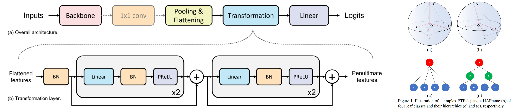

# Hierarchy-Aware Frame (HAFrame)

code release for **[Inducing Neural Collapse to a Fixed Hierarchy-Aware Frame for Reducing Mistake Severity (ICCV2023)](https://arxiv.org/abs/2303.05689)** <br/>


## Model Architecture + "ETF vs HAFrame"
<div align="center">
  
</div>

## Installation
Our code is running under Python 3.8.8
```commandline
pip install -r requirements.txt
```

## Dataset preparation
For iNaturalist2019 and tieredImageNet-H: <br/>
Refer to Repository: [Making Better Mistakes](https://github.com/fiveai/making-better-mistakes) <br/> 
For CIFAR-100, we use torchvision.datasets.CIFAR100 API in:
```
util/data_loader.py
```
For FGVC-Aircraft, the dataset preparation code is at:
```
_fgvc_aircraft/fgvc_dataset_preprocessing.py
```

## Configure dataset paths
modify the /data_paths.yml files, e.g.:
```
fgvc-aircraft: 'C:/DATASET/fgvc_aircraft/'
cifar-100: 'C:/DATASET/CIFAR-100/'
inaturalist19-224: 'C:/DATASET/iNat2019/'
tiered-imagenet-224: 'C:/DATASET/tiered_ImageNet_H/'
```

## The Hierarchies and hierarchical distances
For iNaturalist2019 and tieredImageNet-H: <br/>
Refer to Repository: [Making Better Mistakes](https://github.com/fiveai/making-better-mistakes). <br/> 
For CIFAR-100, its hierarchy is provided by [Fine-Grained-or-Not](https://github.com/PRIS-CV/Fine-Grained-or-Not). <br/>
For FGVC-Aircraft, its hierarchy comes with the dataset's annotations. 

We also provide copies of the hierarchies used in this work: <br/>
```
data/fgvc_aircraft_tree.pkl
data/cifar-l5/original/cifar_100_tree.pkl
data/inaturalist19_tree.pkl
data/tiered_imagenet_tree.pkl
```
The associated hierarchical distances files are located at: <br/>
```
data/fgvc_aircraft_original_distances.pkl.xz
data/cifar-l5/original/cifar_100_ilsvrc_distances.pkl.xz
data/inaturalist19_ilsvrc_distances.pkl.xz
data/tiered_imagenet_ilsvrc_distances.pkl.xz
```

## Experiments

Training, testing, and neural collapse visualization scripts for dataset are included in:
```
experiments
```
e.g., training and evaluation scripts of the proposed HAFrame approach on tieredImageNet-H:
```commandline
bash experiments/tiered-imagenet-224/type-II-haframe.sh
```
e.g., generating HAFrame vs ETF neural collapse for iNaturalist2019: 
```commandline
bash experiments/inaturalist19-224/neural-collapse-viz.sh
```
All the bash scripts need to be executed at the same directory with main.py <br/>

All of our experiments are conducted on machines with one Nvidia A100 GPU. 


## Acknowledgement
This codebase is largely refactored from the following GitHub repos: <br/>

- [making-better-mistakes](https://github.com/fiveai/making-better-mistakes) 
- [CRM-Better-Mistakes](https://github.com/sgk98/CRM-Better-Mistakes)
- [Neural_Collapse](https://github.com/corwinliu9669/Neural_Collapse)
- [HAF](https://github.com/07Agarg/HAF)


 